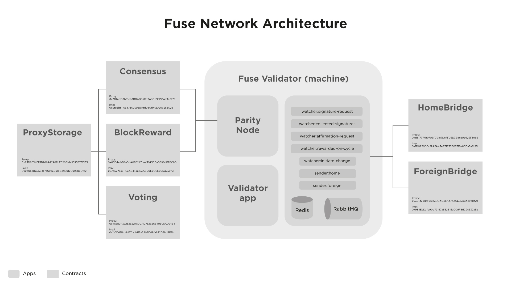

Consensus is a fault-tolerant mechanism used in blockchain systems to achieve the necessary agreement on the single state of the network. The Fuse Network uses a Delegated Proof of Stake (DPoS) consensus model. DPoS is a variation of Proof of Stake consensus.

In PoS, there are a set of validators that are responsible for keeping the network updated and validating the network's state. They do this in turns, and every validator has their turn. On their turn, the validator updates the network's state, and the rest of the validators check that the update is valid.

A consensus contract is used to manage the list of network validators and delegators

BlockReward contract calculates the reward amount validators and delegators will receive on each block validation. The reward size is proportional to the validator's stake.

With Voting, contract validators vote on changes to these three base-level contracts. All those contracts are proxied with an implementation that handles the logic. The implementations can be changed only by the Voting process.

The bridge transfers the Fuse native token between Fuse and Ethereum networks.

## Consensus - 0x3014ca10b91cb3d0ad85fef7a3cb95bcac9c0f79

This contract is responsible for handling the network DPos consensus. The contract stores the current validator set and chooses a new validator set at the end of each cycle.
The logic for updating the validator set is to select a random snapshot from the snapshots taken during the cycle.

The snapshots are taken of pending validators who staked more than the minimum stake needed to become network validators. Therefore, the contract is also responsible for staking, delegating, and withdrawing those funds.

The stake amount for a validator is the sum of staked and delegated amount to its address.

This contract is based on non-reporting ValidatorSet described in Parity Wiki.

:::info

minimum stake amount = 100,000 Fuse token

cycle duration blocks = 34560 (approximately 2 days)

:::

## Block Reward - 0x63D4efeD2e3dA070247bea3073BCaB896dFF6C9B

This contract generates and distributes block rewards to the network validators according to the network specs (5% yearly inflation).

Another role of this contract is to call the snapshot/cycle logic on the Consensus contract

This contract is based on BlockReward described in Parity Wiki.

## Voting - 0x4c889f137232E827c00710752E86840805A70484

This contract is responsible for opening new ballots and voting to accept/reject them. Ballots are offers to change other network contracts' implementation.

Only network validators can open new ballots, and everyone can vote on them, but only validators' votes count when the ballot is closed.

Ballots are opened/closed on the cycle end.

:::info

max number of open ballots = 100

max number of open ballots per validator = 100 / number of validators

minimum ballot duration (cycles) = 2

maximum ballot duration (cycles) = 14

:::

## Proxy Storage

This contract is responsible for holding network contracts implementation addresses and upgrading them if necessary (via voting).
